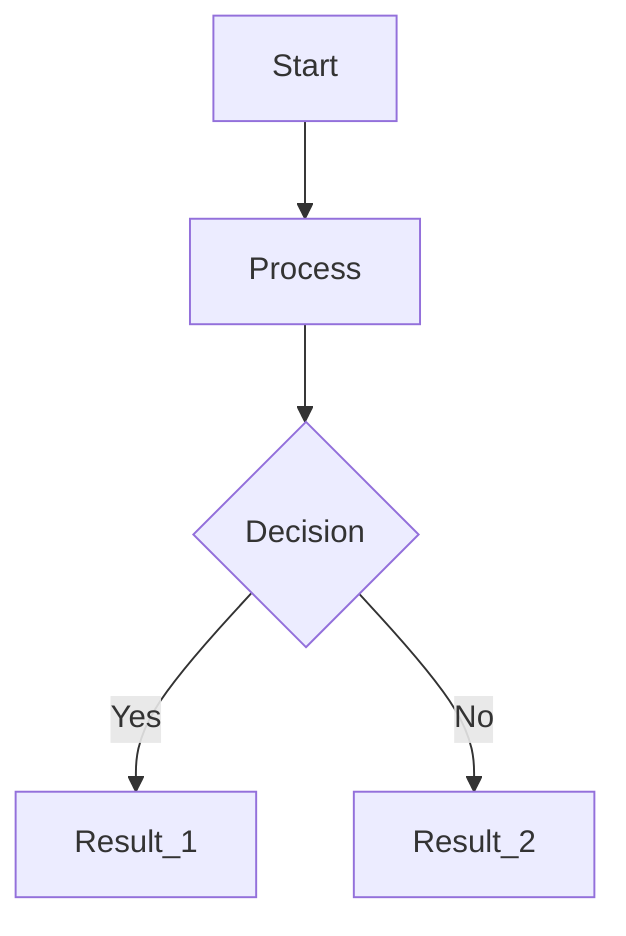
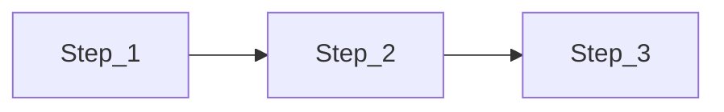
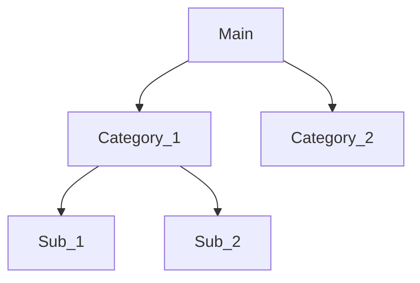

# Mermaid Diagram Guidelines

## Common Mermaid Syntax Patterns

1. Basic Flowchart (Most Common)

2. Linear Process Flow (Use when showing steps)

3. Hierarchical Structure (Use for classifications)

## Key Rules for Error-Free Diagrams
- Use TD (top-down) or LR (left-right) for clear direction
- Always connect nodes with --> arrows
- Avoid spaces in node names - use underscores
- Use proper brackets: [] for process, {} for decisions
- Keep connections logical and clearly defined
- Test complex diagrams in parts first

## For Complex Diagrams
1. Start with basic structure
2. Add connections step by step
3. Verify syntax at each major addition
4. Keep node names short but descriptive
5. Use consistent naming conventions

## Common Node Shapes
- `[]` Rectangle (default, for processes)
- `{}` Diamond (for decisions)
- `()` Circle (for start/end points)
- `[[]]` Double rectangle (for databases)
- `(())` Double circle (for special points)

## Error Prevention Checklist
- Confirm all nodes are properly connected
- Verify all node names are unique and valid
- Check bracket pairs are matching
- Ensure arrow directions are consistent
- Validate diagram flows logically
- Keep diagram complexity manageable